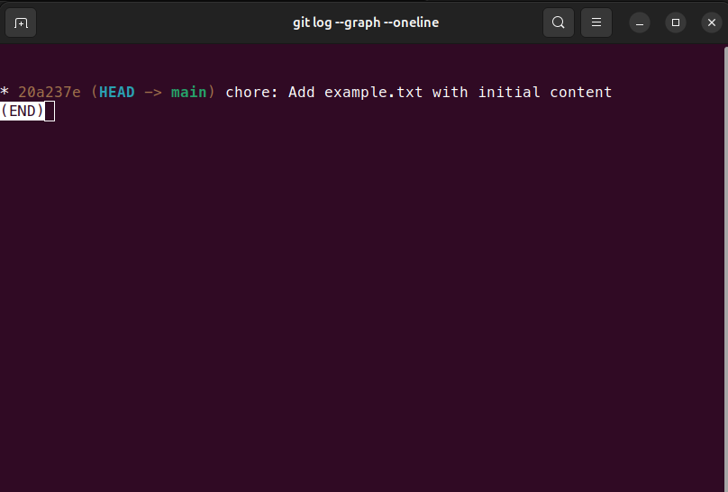
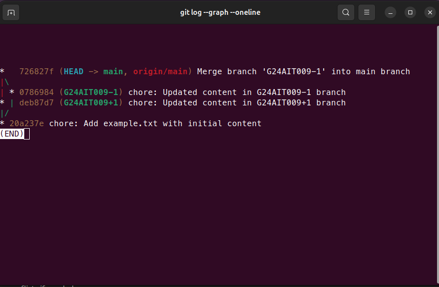
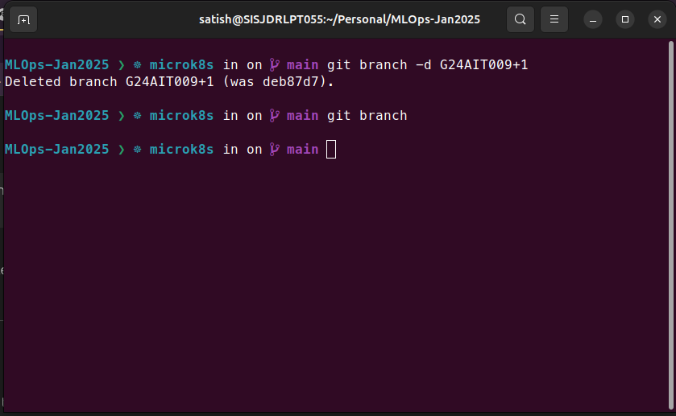
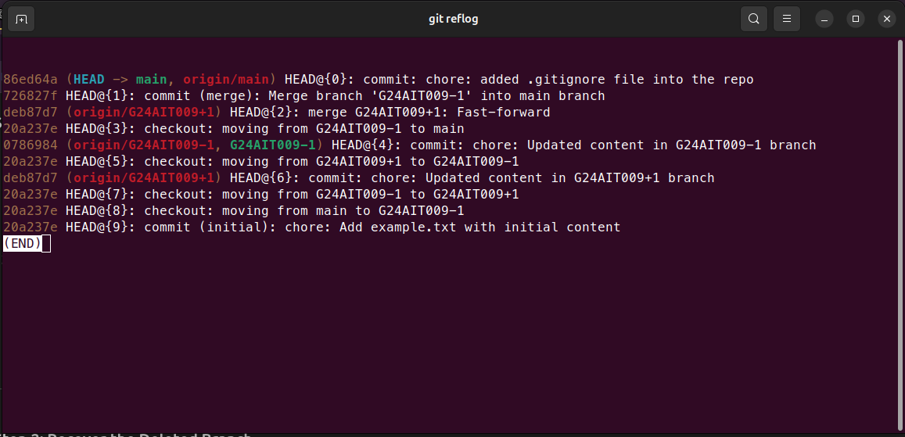
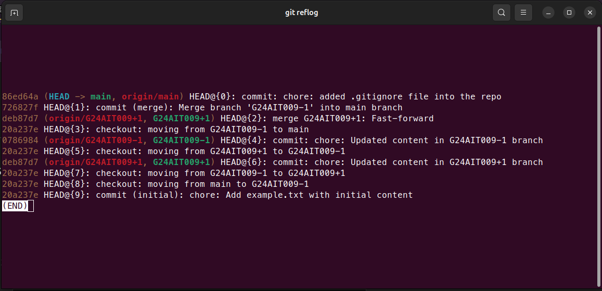
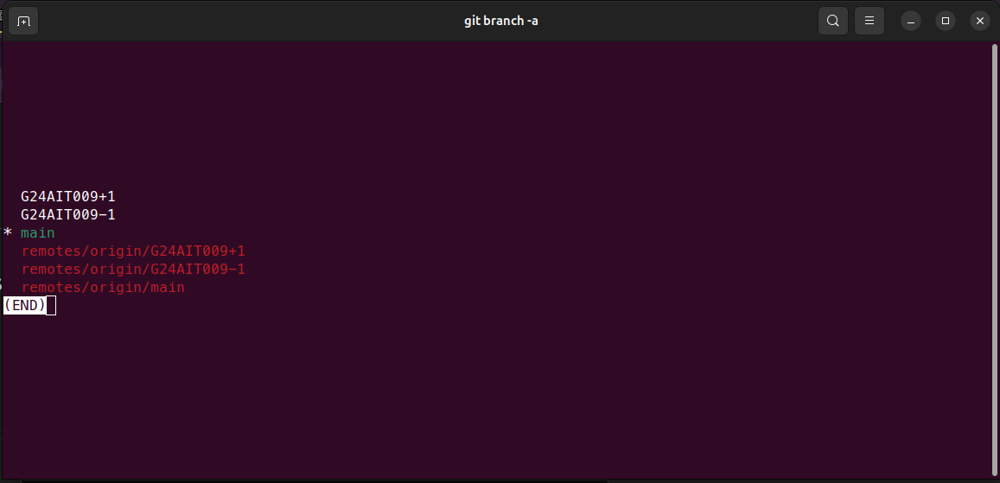
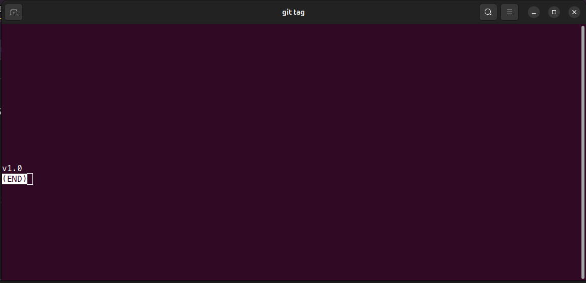

# Report for MLOps Assignment-1

## GitHub Repository Link

[https://github.com/satishjhanwer/MLOps-Jan2025](https://github.com/satishjhanwer/MLOps-Jan2025)

## Process Description

### Step 1: Created a New Public Repository

- Accessed GitHub and created a repository named `MLOps-Jan2025`.
- Set the repository visibility to **Public**.

### Step 2: Cloned the Repository Locally

- Used the following command to clone the repository:

```bash
  git clone https://github.com/satishjhanwer/MLOps-Jan2025.git
```

- Navigated into the cloned repository:

```bash
  cd MLOps-Jan2025
```

### Step 3: Added and Committed a File

- Created a new file named `example.txt` with the following content:

```text
  This is the initial content of example.txt
```

- Staged and committed the file:

```bash
  git add example.txt
  git commit -m "Add example.txt with initial content"
```

### Step 4: Created Two Branches

- Determined branch names based on the roll number (e.g., `G24AIT009-1` and `G24AIT009+1`).
- Created the branches using:

```bash
  git branch G24AIT009-1
  git branch G24AIT009+1
```

### Step 5: Modified the File in Each Branch

#### In `G24AIT009+1` branch

- Switched to the branch:

```bash
  git checkout G24AIT009+1
```

- Modified the content of `example.txt`:

```text
  This is the modified content for G24AIT009+1 branch
```

- Committed the changes:

```bash
  git add example.txt
  git commit -m "Update content in G24AIT009+1 branch"
```

#### In `G24AIT009-1` branch

- Switched to the branch:

```bash
  git checkout G24AIT009-1
```

- Replaced the content of `example.txt` entirely:

```text
  This is the entirely replaced content for G24AIT009-1 branch
```

- Committed the changes:

```bash
  git add example.txt
  git commit -m "Replace content in G24AIT009-1 branch"
```

### Step 6: Captured Git Log Screenshot (Before Merge)

- Switched back to the main branch:

```bash
  git checkout main
```

- Ran the following command to view the log graph:

```bash
  git log --graph --oneline
```

- Took a screenshot of the output.

### Step 7: Merged the Branches

#### Merging `G24AIT009+1` into `main`

- Merged the branch:

```bash
  git merge G24AIT009+1
```

- Resolved any conflicts and committed the merge.

#### Merging `G24AIT009-1` into `main`

- Merged the branch:

```bash
  git merge G24AIT009-1
```

- Resolved any conflicts and committed the merge.

### Step 8: Captured Git Log Screenshot (After Merge)

- Viewed the updated log graph:

```bash
  git log --graph --oneline
```

- Took a screenshot of the output.

### Step 9: Pushed All Changes

- Pushed all branches and commits to the remote repository:

```bash
  git push origin --all
```

### Step 10: Deleted and Recovered a Branch

- Deleted the `G24AIT009+1` branch:

```bash
  git branch -d G24AIT009+1
```

- Recovered the branch using `git reflog`:

```bash
  git reflog
  git branch G24AIT009+1 <commit-hash>
```

- Verified recovery using:

```bash
  git branch
```

- Took a screenshot of the `git reflog` and `git branch` outputs.

### Step 11: Added a Tag

- Tagged the latest commit in the `main` branch:

```bash
  git tag -a v1.0 -m "Tagging version 1.0"
```

- Verified the tag:

```bash
  git tag
```

- Pushed the tag to the remote repository:

```bash
  git push origin v1.0
```

- Took a screenshot of the `git tag` output.

## Challenges Faced and Resolutions

- **Branch Naming:** Ensured branch names adhered to the assignment format based on the roll number.
- **Conflict Resolution:** Encountered merge conflicts while merging branches and resolved them by carefully choosing the desired content for the main branch.
- **Branch Recovery:** Used `git reflog` to recover a deleted branch.
- **Tagging:** Successfully tagged the latest commit to mark a milestone.

## Screenshots

**Git Log Before Merge:**



**Git Log After Merge:**



**Branch Deletion:**



**Reference Log after Branch Deletion:**



**Reference Log after Branch Recovered:**



**Branch Status:**



**Tag Status After Tag Creation:**



---
